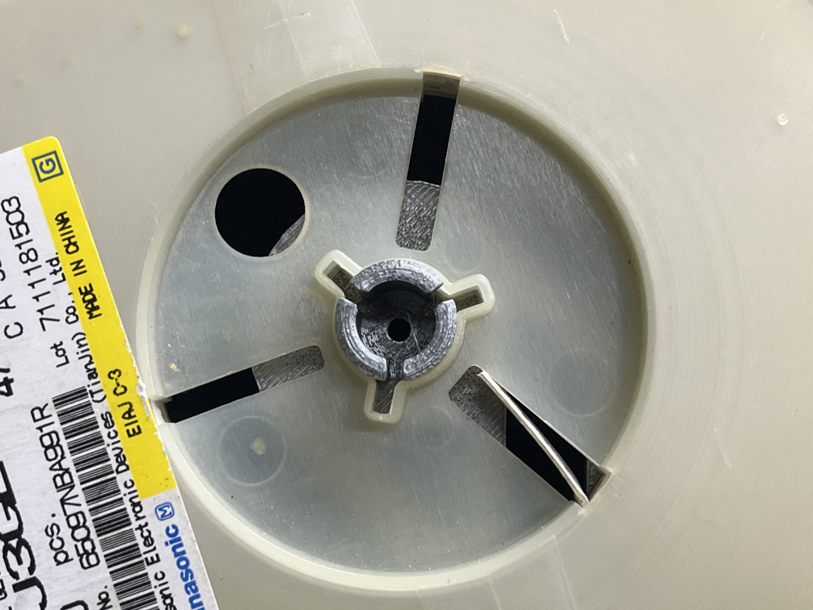

# SMD Reel Holder 3

本モデルは、以下の Thingiverse モデルをベースに改良を加えたものです。

https://www.thingiverse.com/thing:4777182

SMD リールの保管・整理を、より安全かつ使いやすくすることを目的として設計しました。

---

## 概要

**SMD Reel Holder 3** は、DIN レールに取り付け可能な SMD リールホルダーです。  
従来モデルの使い勝手や耐久性を見直し、設置方法のバリエーションも追加しました。

- スナップフィットの耐久性向上
- DIN レールへの取り付け性改善
- 床置きタイプに加えて壁掛けタイプを追加

---

## 外観

### 通常版（床置き / 水平設置）

---

## 改良点（SMD Reel Holder 3）

### 1. スナップフィット構造の改良

リールを固定するスナップフィット部の設計を見直し、  
ツメに過度な応力がかからない形状に変更しました。  
これにより、着脱時にツメが折れにくくなっています。

#### 改良したスナップフィット部

---

### 2. DIN レール取付部の改善

DIN レールへの取り付け部を再設計し、  
工具なしでも着脱しやすい構造にしました。  
位置調整やレイアウト変更も簡単に行えます。

---

### 3. 壁掛けタイプの追加

従来の床置き（水平）タイプに加え、  
壁面に取り付け可能な **90 度回転タイプ** を新たに追加しました。  
作業スペースや収納環境に応じて使い分けが可能です。

---

## SMD Reel Holder 2（改良版）について

**SMD Reel Holder 2** には、  
リールの取り付けが難しい、スナップフィットのツメが折れやすい  
といった問題がありました。

本リポジトリに含まれる **SMD Reel Holder 2（改良版）** は、  
既存の **SMD Reel Holder 2** を使用していて破損や使いにくさを感じていた場合の  
置き換え用モデルとして利用できます。

サイズや外形形状は従来モデルと同一で、  
リール取り付け部（スナップフィット）のみを改良しています。

---

## モデルバリエーション

- 通常版（床置き / 水平設置）  
  `SMD_Reel_Holder_3.3mf`

- 壁掛け版（90 度回転）  
  `SMD_Reel_Holder_3_wall_mount_90deg.3mf`

- SMD Reel Holder 2（改良版）  
  `reel_holder_2_domino.3mf`  
  ※ 旧型 SMD Reel Holder 2 と形状互換の改良モデルです。

用途や設置環境に応じてお好みのモデルを選択してください。

---

## 注意事項

- 3D プリンタや材料の特性により、嵌合がきつい場合があります。
- 必要に応じてスナップフィット部の微調整を行ってください。
- 本モデルの使用は自己責任でお願いします。

---

ご意見・改善案がありましたら Issue や Pull Request を歓迎します。
